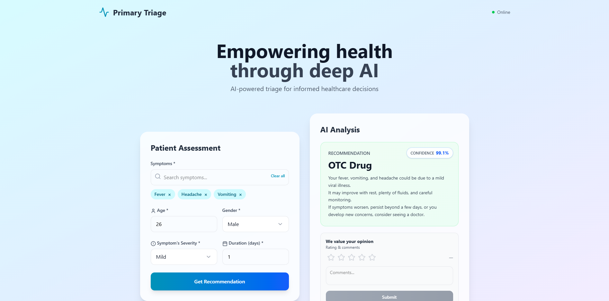

# Medical Triage System

An intelligent triage system that uses machine learning and LLM technology to classify and prioritize medical symptoms. The system analyzes patient inputs and provides recommendations for either **OTC Drug** treatment or **Doctor Consultation** based on symptom severity, patient history, and AI-powered safety review.

## UI Preview

## Backend

- FastAPI
- LangChain + Cerebras (LLM integration)
- ML model
- PostgreSQL (data persistence)

## Features

- Symptom-based triage classification
- Soft voting ensemble (RF, KNN, DT, XGB, LGBM)
- Real-time prediction API
- User feedback collection
- Docker containerization
- AWS Docker deployment
